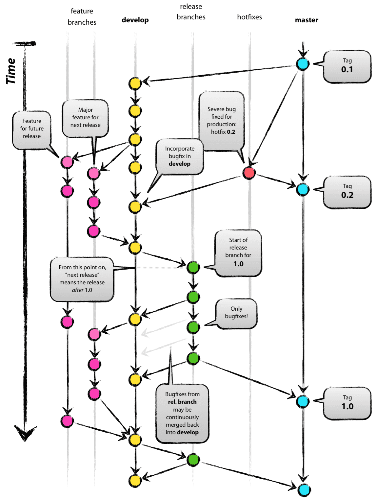
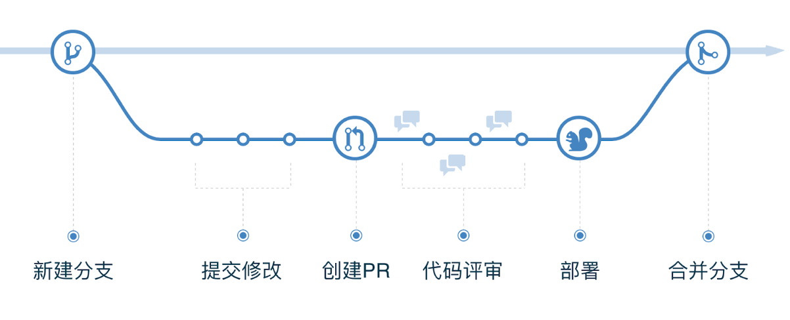

上篇[《git tag使用指南》](/tool-git-tag/)简单介绍了下如何利用tag来做简易的git版本控制，但我在查资料的时候发现了很多有意思的内容，我版本控制只用过git，三大工作流虽然都用过，但没去深究过，知之甚少啊。本来以为git应该一家独大了，和几位朋友聊了下发现还有很多很多公司在用svn，甚至还有在用vss的，我着实井底之蛙了。本🐸目前还是用git为主，其他工具学不动了，所以本篇还是以git为主展开。

<!--more-->

## 常见版本控制系统
- **本地版本控制**：大多都是采用某种简单的数据库来记录文件的历次更新差异，其中最流行的一种叫做 RCS，在硬盘上保存补丁集（补丁是指文件修订前后的变化）。
- **集中式版本控制**（Centralized Version Control Systems，CVCS）：必须联网使用、单一的集中管理服务器、学习成本低。
  - CVS（Concurrent Versions System，1986）采用Copy-Modify-Merge（修改－冲突－合并）并发工作模式。它的网络化首次允许多个开发人员检出并同时处理相同的文件。
  - VSS（Visual Source Safe，1994）微软出品，主要采用Lock-Modify-Unlock（锁定－编辑－解锁）独占工作模式，一个文件一个时间点上只有一个人有权利修改并提交，版本号对应的是单个文件。
  - SVN（Subversion，2000）开源免费，采用了分支管理系统，设计目标就是取代CVS，采用Copy-Modify-Merge并发工作模式。
- **分布式版本控制**（Distributed Version Control System，DVCS）：支持离线、分布式、完整备份、轻量、学习成本较高。
  - Mercurial（HG，2005）是目前次于Git的分布式VCS，随着2019年BitBucket宣布停止对Mercurial的支持，代表着Mercurial逐渐没落。
  - Git（2005）是目前最主流的分布式开源版本控制系统，设计初衷完全是为了解决开发Linux内核所产生的实际问题。

目前最多被使用的还是Git和SVN，一直有很多人在争论哪个更好，此处借用一个[高赞回答](https://stackoverflow.com/questions/871/why-is-git-better-than-subversion)：**Git is not better than Subversion. But is also not worse. It's different.**
Git非常适合开源社区，但并不适合所有企业。就像Google、Facebooke、华为、网易等这类大公司都因为Git的局限性而没有选择Git，比较典型的就是Google自研了非常🐂的单一代码仓库、主干开发模式的版本管理系统Piper。[主要是因为Git不适合超大型项目和没有文件级权限控制](https://svnbucket.com/posts/svn-vs-git-difference/)。所以，根据实际情况选择适合的工具才是最明智的。

谈到Google的Piper想插一嘴，monorepo是现在很火的一种代码管理模式，也是在微前端领域经常被提到的词汇，指的是在一个项目仓库 (repo) 中管理多个模块/包 (package)。Babel、Vue、React、Npm7等等许多开源项目也都采用了monorepo模式，Yarn和Npm也都支持使用Workspaces字段来管理monorepo。如果公司内部有大型项目的话，不妨尝试一下。有兴趣的可以参考[《All in one：项目级 monorepo 策略最佳实践》](https://mp.weixin.qq.com/s/mV6gvPy-N3NZPEYONV4A0A)这篇文章。

## git三大工作流
鉴于Git的灵活性，出现了各种各样的工作流。[常见工作流](https://www.atlassian.com/git/tutorials/comparing-workflows#centralized-workflow)可大致分为集中式、功能分支、Forking三种，业界的三大知名工作流（Git flow、GitHub flow、GitLab flow）均属于功能分支工作流类型。
- **集中式工作流**（Centralized Workflow）：类似svn，是只使用一个分支（master）的开发方式，缺点是不同开发的提交混杂在一起，难以定位问题。
- **功能分支工作流**（Feature Branch Workflow）：核心理念是所有功能开发都应该在专用分支而不是主分支中进行。通常是一个主干master分支 + 多个feature分支。
- **Forking工作流**（Forking Workflow）：以Github为代表的一种代码协作方式，开发者通过Fork源仓库进行编写代码，完成后发起pull request，源仓库作者可以选择是否接受该PR。

### Git flow
[Git flow](https://danielkummer.github.io/git-flow-cheatsheet/index.zh_CN.html)是最早诞生、并得到广泛采用的一种工作流程。从2010年作者Vincent Driessen发表[《A successful Git branching model》](https://nvie.com/posts/a-successful-git-branching-model/)开始，Git flow被大量团队视为规范，同时也饱受争议。2020年Vincent Driessen再次发声，称在持续交付的情况下更推荐使用GitHub flow这类简单工作流。虽然Git flow已跌落神坛，但还是很值得借鉴的。

Git flow相当严格，清晰可控，各方面都考虑的很周全，但也比较复杂，实施起来如果不依赖自动化工具，单纯靠项目成员自觉遵守的难度比较大。它基于版本发布，目标是一段时间以后产出一个新版本，但是现在web项目大多都是持续发布，这时master和develop差别不大，就没必要维护两个长期分支，这也是被众多团队诟病的地方。

- **主分支（master）**：长期分支，一般用于管理对外发布版本，每个tag都对应一个发布版本。
- **开发分支（develop）**：长期分支，一般用于作为日常开发汇总，即开发版的代码。
- **功能分支（feature/*）**：短期分支，一般用于一个新功能的开发。从develop分支分出，开发完成后，再并入develop，最后删除该分支。
- **预发布分支（release/*）**：短期分支，发布正式版本之前用于测试的预发布版本。从develop拉出，预发布结束后，合并进develop和master，最后在master打个tag，并删除该预发布分支。
- **修补分支（fixbug/*）**：短期分支，从master拉出，修补结束后，合并进develop和master，最后在master打个tag，删除该修补分支。
- **辅助分支（support/*）**：长期分支，一般用于特殊功能支持的分支，不合并到主分支。属于实验性分支，所以一般不会提到，利用这个分支可以使工作流同时支持多版本。

### GitHub flow
[GitHub flow](https://docs.github.com/cn/get-started/quickstart/github-flow)是GitHub[在2011年发布的工作流模型](http://scottchacon.com/2011/08/31/github-flow.html)，是Git flow的简化版，专门配合"持续发布"。GitHub flow只有一个长期分支，就是master，因此用起来非常简单。
GitHub flow的最大优点就是简单，适合小团队、需求少和持续发布的项目，但是它不适用于以下场景：版本延迟发布（例如应用审核）、不同环境的部署（例如测试环境，预发环境，正式环境）、不同版本发布与修复。

- 第一步：根据需求，从master拉出新分支，不区分功能分支或补丁分支。
- 第二步：新分支开发完成或需要讨论的时候，就向master发起一个pull request（简称PR）。
- 第三步：PR既是通知又是对话机制，可以一起评审和讨论代码，过程中还可以不断提交代码。
- 第四步：PR被接受，合并进master，部署到生产环境后，删除本次需求拉出的分支（也可先部署再合并）。

### GitLab flow
[GitLab flow](https://docs.gitlab.com/ee/topics/gitlab_flow.html)是Gitlab在2014年创建的工作流，吸取了Git flow与GitHub flow两者的优点，既有适应不同开发环境的弹性，又有单一主分支的简单和便利。GitLab flow分为持续发布与版本发布两种情况，以适应不同的发布类型。
- **持续发布**：
  - 为不同的环境建立不同的分支：开发环境master、预发环境pre-production、生产环境production。
  - 上游优先原则（upsteam first）：只存在一个主分支master，是所有其他分支的"上游"，代码合并的顺序要按环境依次推送，确保代码被充分测试过，才会从上游分支合并到下游分支。master => pre-production => production。
- **版本发布**：每个稳定版本都从master拉出一个分支，比如2-3-stable、2-4-stable等等。只有修补bug，才允许将代码合并到这些分支，并且此时要更新小版本号。

### 其他flow
- [Trunk-based development](https://trunkbaseddevelopment.com/)：是持续集成思想所崇尚的工作方式，由单个主干分支和多个发布分支组成，没有显性的特性分支，每个发布分支在特定版本的提交点上从主干创建，用来进行上线部署和Hotfix。
- [OneFlow](https://www.endoflineblog.com/oneflow-a-git-branching-model-and-workflow)：Git flow简化版，只有一个长期主分支master。它的一个变体是双主分支，即develop和master。
- AoneFlow：阿里研发效能事业部基于TrunkBased和GitFlow提出的新思路。只使用三种分支类型：主干分支、特性分支、发布分支。从主干创建特性分支，通过合并特性分支形成发布分支，发布到线上正式环境后，合并相应的发布分支到主干，在主干添加标签，同时删除该发布分支关联的特性分支。
- [Dictator and Lieutenant Workflow](https://git-scm.com/book/zh/v2/%E5%88%86%E5%B8%83%E5%BC%8F-Git-%E5%88%86%E5%B8%83%E5%BC%8F%E5%B7%A5%E4%BD%9C%E6%B5%81%E7%A8%8B)：多仓库工作流程的变种，一般适用于拥有数百位协作开发者的超大型项目，例如Linux内核。项目总负责人（即主管）可以把大量分散的集成工作委托给不同的小组负责人分别处理，然后在不同时刻将大块的代码子集统筹起来，用于之后的整合。

## 总结
SVN还是Git？Git flow有害？Monorepo还是Multirepo？网上很多程序员围绕这几个话题吵架吵得很凶，就像有人大喊了一句“PHP是世界上最好的语言”一样。引用下Vincent Driessen说的：“To conclude, always remember that panaceas don't exist. Consider your own context. Don't be hating. Decide for yourself.”
上文介绍的一些工作流已经基本上能覆盖到所有的开发场景，但这些工作流只作为指导原则，而不是具体规则。可以根据项目情况选用其中一套成熟的工作流，同时对于一些实际问题做一些调整，以提高工作效率为根本目的，做出一套最适合的工作流。
- 集中式工作流适用于从SVN迁移到Git或较小规模的团队。
- Fork工作流适用于公共开源项目。
- Git flow适用于大团队多版本并存迭代的开发流程。
- GitHub flow适用于中小型团队持续集成的开发流程。
- GitLab flow适用范围则介于上面二者之间，支持持续发布与版本发布两种情况。

### 一些小技巧
- **善用工具和插件**：像Sourcetree和Git Tower这类可视化工具都有集成git flow，vscode也能搜到各类flow的插件，还有git-flow-avh这类的命令工具，如果公司有发布平台能自动管理流程的话那是更加不错了。
- **保护长期分支**：比较重要的项目建议将长期分支保护起来，只允许负责人修改和审批，开发人员必须通过Pull Request（Gitlab里面叫Merge Request）来将新代码合并至长期分支。
- **短期分支存在时间不能过长**：多人协作的项目，如果短期分支的需求开发周期较长，建议分割成多个分支定期合并，防止后期产生冲突，被合并后也要及时更新tag并删除，保持分支区域的整洁。
- **学好英语🥲**：查资料全是英文，[《The best way to use Git and GitHub》](https://githubflow.github.io/)、[《What are GitLab Flow best practices?》](https://about.gitlab.com/topics/version-control/what-are-gitlab-flow-best-practices/)这类优秀的最佳实践文章值得一看。

