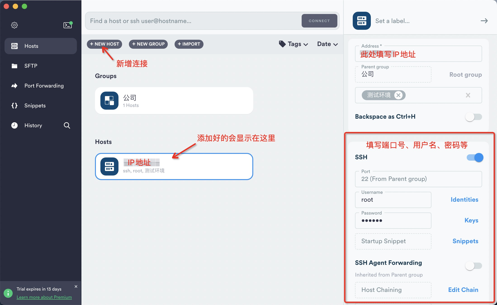
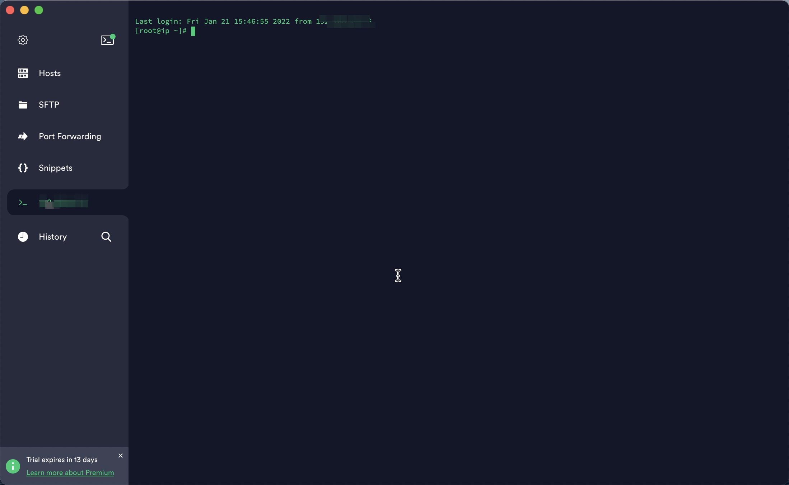
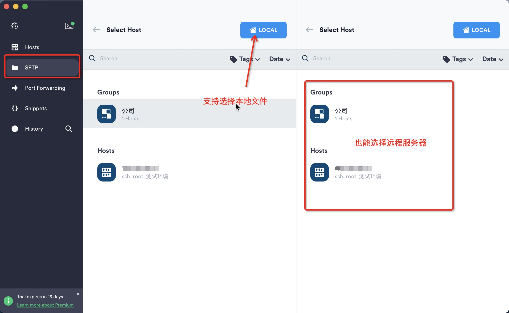
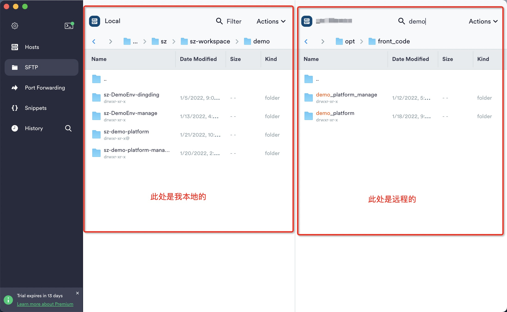
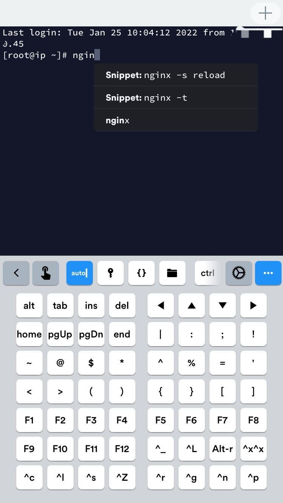
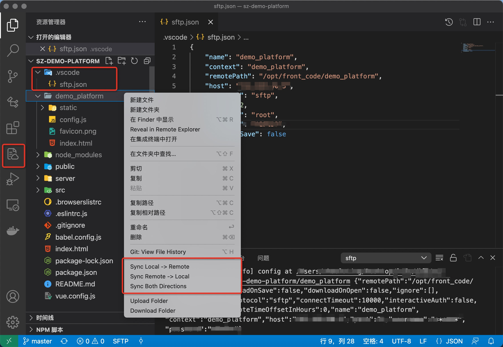
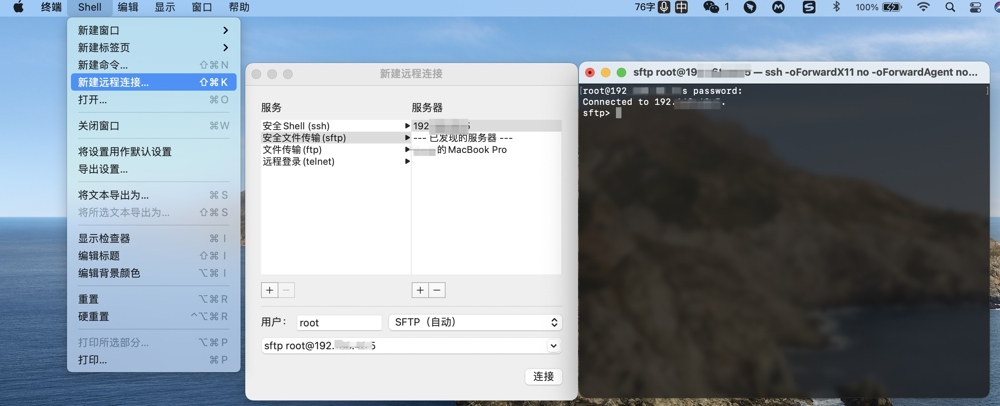

公司架构原因，前端部署还没有实现CI/CD，仍需要本地打包再上传到服务器。这种部署方式以前工作上没用过，只有早前自己玩服务器的时候学过，但只停留在会用的阶段。正好借这个机会把知识补一补，顺带安利下自用的一些工具。
<!--more-->

## 技术概述
### FTP
- FTP即**文件传输协议**（File Transfer Protocol），TCP/IP协议组中的协议之一，是用于计算机网络上在客户端和服务器之间进行文件传输的应用层协议。通俗讲就是可以通过网络将数据文件从一台计算机传输到另一台计算机。FTP包括客户端和服务器两部分，使用命令通道（默认端口21）和数据通道（默认端口20）两个独立的通道来传输信息。
- **两种传输模式**：
  - 主动模式（PORT，默认）下，建立命令通道后，服务器将启动与客户端的数据连接。主动模式更利于管理服务端，因为只需打开21端口“准入”、20端口“准出”即可。
  - 被动模式下（PASV），建立命令通道后，由客户端启动与服务器的数据连接。被动模式更利于管理客户端，因为如果由服务器发送连接请求可能会触发客户端防火墙。
- **FTP缺点**：安全隐患（明文传输，无法保证安全性）、缺乏可见性（无法维护对系统操作的审核跟踪）、存储开销大（不允许发件人自动过期或删除文件）、工作流程繁琐。


### FTPS
- FTPS也称作“FTP-SSL”和“FTP-over-SSL”，是一种对FTP添加SSL/TLS加密协议支持的扩展协议，即**加密版FTP**。 
  - **SSL**（Secure Socket Layer，安全套接字层）通过互相认证、使用数字签名确保完整性、使用加密确保私密性，是为HTTP/SMTP等加密设计的（HTTPS = HTTP + SSL/TLS）。
  - **TLS**（Transport Layer Security，传输层安全协议）用于两个应用程序之间提供保密性和数据完整性。
- FPTS有**隐式SSL**和**显式SSL**两种模式：
  - 当启用隐式模式时，FTP的默认端口就被改为TCP/990，服务器自动建立安全连接，并且要求客户端也必须支持安全连接模式也就是使用SSL进行连接。
  - 当启用显式模式时，与FTP连接方式和默认端口一样，但是需要以命令AUTH SSL/TLS类型的命令进行激活安全连接后才能正常传输数据。


### SFTP
- SFTP即**安全文件传输协议**（Secure File Transfer Protocol），语法与FTP一样，在客户端和服务器之间通过SSH协议（默认端口22）建立的安全连接来传输文件。
  - **SSH**（Secure Shell，安全外壳协议）是专为远程登录会话和其他网络服务提供安全性的协议。
  - SSH软件包中包含SFTP安全文件传输子系统，SSH最初又是Unix中的一个程序，所以Unix、Linux系统中都是自带SSH和SFTP。
- SFTP仅使用单个通道，允许使用用户名/密码或SSH加密密钥对客户端进行身份验证，并且在客户端和服务器之间移动的数据是加密的，虽然传输速率比FTP低，但是非常安全。
- SFTP和FTPS很容易混淆，但它们俩是完全不同的，SFTP主体是SSH，而FTPS主体是FTP。
- 像使用“丢包”的方式部署网站时，更建议使用SFTP。用网上很形象的一个说法解释就是，SSH像铺管子，SSL像打包裹，它们都能保证数据的安全，但SSH是管子所以更适合FTP的安全传输。


## sftp工具推荐
### 热门工具
以下是网上推荐的最多的几款工具，都很好用
- [FileZilla](https://www.filezilla.cn/)：老牌，免费，支持macOS、Windows，客户端工具中算是榜首老大哥了。
- [WinScp](https://winscp.net/eng/index.php)：老牌，免费，只支持Windows。
- [termius](https://www.termius.com/)：全平台应用，支持macOS、Windows甚至手机端，[部分功能收费](https://www.termius.com/pricing)。
- [transmit](https://panic.com/transmit/)：收费，只支持macOS。

### termius
[termius](https://www.termius.com/)是我个人最喜欢的一款，支持Windows / macOS / iOS / Android / Linux，全平台软件，颜值也高，可惜sftp功能要付费。但使用学生认证的GitHub账号登录可以免费用哦😏弟弟妹妹们的用处到了，[github大礼包](https://education.github.com/pack)薅起来！

> 但在Mac上通过appstore下载的termius无法访问本地文件，官方解决办法是：在本地开一个ssh服务或者去官方网站下载软件。

<div style="width:74%;display:inline-block">
    
</div>

### vscode插件
[vscode-sftp](https://marketplace.visualstudio.com/items?itemName=liximomo.sftp)是ftp工具中我使用频率最高的一个插件，使用很简单，又很直观，对于前端来说很实用。详细使用说明和配置可以在[这里](https://github.com/liximomo/vscode-sftp/wiki/Setting)查看。


#### 常用功能
- 同步本地与远程服务器上的文件
- 本地与远程的同文件对比（diff）
- 可视化远程目录及远程文件的删除
- 快捷打开已登录远程服务器的终端
- 支持映射多台远程服务器：[配置范例](https://github.com/liximomo/vscode-sftp#example-configs)

#### 使用步骤
- **初始化**：VSCode中打开本地项目，Windows/Linux系统按下`Ctrl+Shift+P`或者macOS系统按下`Cmd+Shift+P`，运行`SFTP:Config`命令后，项目根目录`.vscode`文件夹下就会出现`sftp.json`配置文件，同时VSCode左侧视图会出现sftp项。
- **配置**：在`sftp.json`中填写配置信息，正确填写后才能正常使用sftp功能。
- **对比**：左侧资源管理器中或在打开的文件中右键，点击“Diff with Remote”，即可对比该文件在本地和远程中的区别。
- **上传和下载**：左侧资源管理器中右键点击“Sync Local -> Remote”，即可上传本地文件至远程服务器；点击“Sync Remote -> Local”则可下载远程文件至本地。可在View > Output > sftp（查看 > 输出 > sftp）中查看sftp日志。
- **删除远程文件**：在左侧sftp管理器中右键对应文件，点击“Delete”就可直接删除远程上的对应文件。
- **打开终端**：在左侧sftp管理器中右键根目录，点击“Open SSH in Terminal”就能在VSCode中打开终端并自动登录到远程服务器。


#### Commands
- **SFTP: Set Profile**：设置当前配置文件
- **SFTP: Config**：为项目创建新的配置文件
- **Cancel All Transfers**：停止当前传输（上传和下载）
- **SFTP: Download Active File**：下载当前文件的远程版本并覆盖本地副本
- **SFTP: Download Active Folder**：下载当前文件所在的整个文件夹
- **SFTP: List Active Folder**：列出当前文件所在的文件夹
- **Open SSH in Terminal**：VSCode中打开终端并自动登录到远程服务器
- **SFTP: Sync Local -> Remote**：同步本地代码至远程，可以通过syncOption更改配置。
- **SFTP: Sync Remote -> Local**：同步远程代码至本地
- **SFTP: Sync Both Directions**：比较文件修改时间，并始终执行能使最新文件出现在两端的操作。（skipCreate和ignoreExisting配置对次命令有效）
- **SFTP: Upload Active File**：上传当前文件
- **SFTP: Upload Active Folder**：上传当前文件所在的整个文件夹


#### 配置列表

我常用的配置
```json
{
    "name": "demo_platform",
    "context": "demo_platform",
    "remotePath": "/opt/front_code/demo_platform",
    "host": "192.168.20.45",
    "protocol": "sftp",
    "port": 22,
    "username": "root",
    "uploadOnSave": false,
    // 如果没配置ssh
    "password": "xxxxx",
    // 如果用了配置了ssh
    "privateKeyPath": "/Users/zhaoluting/.ssh/id_rsa",
}
```

通用配置说明

```json
{
  "name": "标识名称，会在左侧视图中显示",
  "context": "映射到remotePath的本地文件路径，默认值为工作区根目录",
  "protocol": "协议，sftp还是ftp，默认值sftp",
  "host": "服务主机名或IP地址",
  "port": "端口号，默认值22",
  "username": "用于身份验证的用户名",
  "remotePath": "需要连接的远程文件路径，默认‘/’",
  "uploadOnSave": "每次保存代码时上传，默认false",
  "downloadOnOpen": "只要打开文件，就从远程服务器下载，默认false",
  "syncOption": {
    "delete": "从目标路径目录中删除无关的文件",
    "skipCreate": "跳过在目标路径上创建新文件",
    "ignoreExisting": "忽视更新目标路径上存在的文件",
    "update": "仅当远程文件上有更新时才更新目标路径"
  },
  "ignore": "忽略文件，数组",
  "ignoreFile": "忽略文件的绝对路径或相对于工作区根文件夹的相对路径",
  "watcher": {
    "files": "监听文件",
    "autoUpload": "文件更改时上传",
    "autoDelete": "删除文件时移除",
  },
  "remoteTimeOffsetInHours": "远程和本地间的时间差，默认0",
  "remoteExplorer": {
    "filesExclude": "配置排除文件，远程资源管理器根据此设置决定显示或隐藏哪些文件",
  },
  "concurrency": "并发数，默认4",
  "connectTimeout": "连接超时时间，默认10000",
  "limitOpenFilesOnRemote": "限制远程打开的file descriptors数量，非必须不要设置此项，默认false"
}
```

SFTP配置说明

```json
{
  "agent": "代理",
  "privateKeyPath": "本地ssh私钥的绝对路径",
  "passphrase": "配置ssh时的passphrase",
  "interactiveAuth": "键盘交互认证模式，默认false",
  "algorithms": "覆盖连接的默认传输层算法配置",
  "sshConfigPath": "SSH配置文件的绝对路径，默认~/.ssh/config",
  "sshCustomParams": "在终端中打开SSH附加的额外参数"
}
```

FTPS配置说明

```json
{
  "secure": "是否加密，默认false",
  "secureOptions": "加密配置，详见https://nodejs.org/api/tls.html#tls_tls_connect_options_callback",
}
```

### 终端
Mac是Unix系统，所以自带sftp，可以使用终端建立连接


以下是ftp常用终端命令
```bash
# 建立 SFTP 连接
sftp username@hostname 

# SFTP 到 22 以外的端口
sftp -P 2222 root@192.168.20.45

# 跳转远程主机上的目录
cd /opt/front_code

# 列出远程主机上当前目录的内容
ls

# 在远程主机上创建一个目录
mkdir demo_platform

# 删除远程主机上的目录，但该目录必须为空
rmdir demo_platform

# 将文件从远程主机复制到本地计算机
get website-logo.jpg

# 从远程主机复制文件夹，使用-r （递归）选项
get -r images/

# 将文件从本地计算机复制到远程主机
put website-logo.jpg

# 将文件夹从本地计算机复制到远程主机
put -r images/

# 关闭与远程主机的连接，并退出 SFTP
exit
bye
quit
!
```
